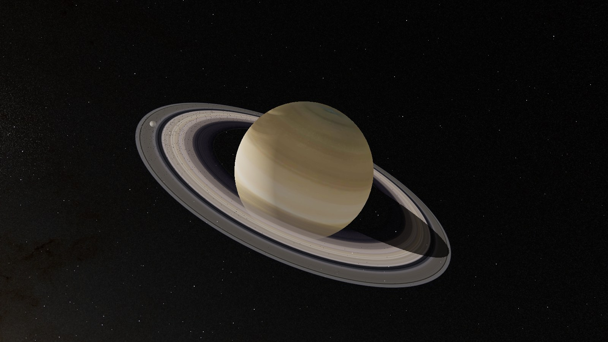

# Orrery

[English](README.md) | **Deutsch**

Interaktive 3D-Simulation des Sonnensystems im Browser, mit Erläuterungstexten in drei
Niveaustufen und einer belegten wissenschaftlichen Grundlage.

**Live: <https://orrery3d.de>**

Ein Orrery ist ein mechanisches Modell der Planetenbewegung, benannt nach dem Earl of Orrery,
für den 1704 eines der ersten gebaut wurde. Dieses hier ist digital: Es rechnet mit
veröffentlichten Bahnelementen, und seine Positionen sind gegen JPL Horizons getestet. Die
Simulation rechnet immer physikalisch korrekt; nur die Darstellung darf Größen und
Helligkeiten überhöhen, damit kleine und ferne Körper sichtbar bleiben. Wie stark sie
überhöht, ist eine Einstellung am Regler, kein fester Kompromiss.

## Datenquellen

| Datensatz | Quelle | Gültigkeit/Genauigkeit |
|---|---|---|
| Planetenbahnen | JPL Approximate Positions, linear gegen die feste Ekliptik J2000 fortgeschrieben (Erde im Modell als Erde-Mond-Schwerpunkt) | Geprüft für 1800 bis 2050; nominelle Fehler in heliozentrischer Länge 15″ (Merkur) bis 600″ (Saturn); für die Erde 20″ Länge, 8″ Breite, 6000 km Abstand |
| Monde | 20 von 21 Mondbahnen auf den Äquator des Mutterkörpers bezogen (dessen Pol zur Epoche fest), keine eigens geführte Laplace-Ebene | Abweichung von JPLs eigener Laplace-Ebene 0,4° (Kallisto), 0,9° (Deimos), 7,6° (Iapetus) |
| Zwergplaneten und Pluto-System | Oskulierende Elemente der JPL Small-Body Database zu eigener Epoche, mit ausschließlich der mittleren Länge als laufender Rate | Gegen die integrierte Ephemeride DE441 weicht Plutos Ort 2000 um 0,05°, 2050 um 0,13°, 1900 um 0,15°, 1800 um 1,4° ab; Pluto steht fest im Ursprung seines Systems statt um den 2126 km (1,79 Plutoradien) entfernten Schwerpunkt |
| Rotation und Pole | Feste Rektaszension/Deklination, überwiegend nach dem IAU-Bericht von 2011; Uranus und Neptun führen die Voyager-2-Radioperioden von 1986/1989, der Marspol den älteren IAU-Bericht von 2009 | Keine Präzession, keine periodischen Glieder; der Katalog nennt −17,24 h für Uranus gegen 17,247864 ± 0,000010 h aus Hubble-Aufnahmen 2011–2022, und 16,11 h für Neptun gegen photometrisch bestimmte 15,9663 h; der ältere Marspol ergibt 25,19° Achsneigung, der seit 2015 amtliche 23,92° |
| Zeitskalen | Die Uhr zeigt das Datum als UTC an, setzt dieselbe Zahl aber unverändert als TDB in die Bahnrechnung ein; gültig vom 1. Januar des Jahres 1 bis zum 31. Dezember 9999, Bahnelemente nur für 1800 bis 2050 geprüft | Der heutige UTC/TDB-Fehler verschiebt die Erde um 2,8″ in ekliptikaler Länge, den Mond um 38″ |
| Finsternisse | Werden gerechnet, nicht aus Tabellen entnommen; die Mondfinsternis-Suche ist gegen den NASA-Katalog geprüft | Trifft 135 von 143 Kernschattenfinsternissen von 1951 bis 2050, mit einer maximalen zeitlichen Abweichung von 3,0 h und einem quadratischen Mittel von 1,8 h |
| Sternkatalog | HYG-Datenbank (Astronexus), Version 4.1, Commit vom 17. August 2024, CC BY-SA 4.0 | 5070 Sterne mit scheinbarer Helligkeit ≤ 6,0 (freiäugige Grenzhelligkeit) |
| Milchstraße | NASA SVS „Deep Star Maps 2020“, gerechnet aus 1,7 Milliarden Sternen von Gaia DR2 (ohne die hellen Hipparcos- und Tycho-Sterne) | SVS-Inhalt gemeinfrei, der Gaia-Anteil steht unter CC BY-NC 3.0 IGO |
| Texturen | 14 Texturen (Sonne, Planeten, Mond, vier Zwergplaneten) von Solar System Scope, CC BY 4.0; 15 weitere (Monde, Pluto, Charon) aus gemeinfreien NASA-/USGS-Astrogeology-Karten | Einzelnachweis je Datei mit Quelle, Bearbeitung und Lizenz in `ASSETS.md` |
| Prüfung gegen JPL Horizons | JPL-Horizons-Vektortafel, heliozentrisch, Ekliptik J2000, in km (Testdaten `src/sim/__fixtures__/horizons.json`) | Vergleicht die berechnete x/y/z-Position der acht Planeten und fünf Zwergplaneten an fünf Stichzeitpunkten zwischen 1850 und 2040 (65 Punkte); Toleranz je Körper, von 12 000 km (Merkur) bis 220 000 000 km (Eris) |

Einzelheiten, auch zu den bekannten Vereinfachungen des Modells, stehen im Thema *Grenzen des
Modells* in der App, in [`ASSETS.md`](ASSETS.md) und in [`docs/belege/hochschule/`](docs/belege/hochschule/).

## Lehrinhalt

Jeder Körper, jede Kinoszene und jedes Thema hat einen Erläuterungstext in drei Stufen, auf
Deutsch und Englisch. Stufe und Sprache lassen sich in der App jederzeit umschalten.

| Stufe | Art der Texte | Daten daneben | Texte |
|---|---|---|---|
| Grundschule | Kurze Texte in einfacher Sprache | Durchmesser, Umlaufzeit, Abstand zur Sonne jetzt | 63 |
| Gymnasium | Zahlen, physikalische Zusammenhänge, Verweise auf verwandte Themen | Dazu Masse, Rotationsperiode, Achsneigung, Exzentrizität, Bahngeschwindigkeit | 63 |
| Hochschule | Gesamte wissenschaftliche Grundlage: Formeln, Tabellen mit Unsicherheiten, Streitfragen mit beiden Seiten, Zitate | Dazu Bahnelemente zur Epoche J2000 samt Raten, Polrichtung, geometrische Albedo | 69 |

Die Texte behandeln 35 Körper (Sonne, acht Planeten, fünf Zwergplaneten, 21 Monde), 19
Kinoszenen und 9 übergreifende Themen wie Finsternisse, Ringsysteme, Achsneigung und
Kirkwood-Lücken. Die Hochschulstufe ergänzt sechs Fachthemen: Gezeiten, Bahnresonanzen,
Bezugssysteme und Zeitskalen, innerer Aufbau, Photometrie und die Entstehung des
Sonnensystems.

Ein eigenes Thema, *Grenzen des Modells*, benennt, was Orrery vereinfacht, und beziffert die
Fehler, die daraus folgen, etwa bei der Zeitskala der Bahnrechnung oder den Rotationsmodellen
der Planeten.

## Quellen und Literatur

- **91 Quellenkarten** verbinden die Texte mit öffentlichem Referenzmaterial: NASA (50),
  Wikipedia (23), JPL (11), ESA (4), IAU (1) und zwei weitere. Sie öffnen in einem neuen Tab
  und werden nie eingebettet.
- **761 Fachpublikationen** bilden den Literaturkatalog der Hochschultexte, 737 davon mit DOI.
  Jeder Eintrag wird automatisch gegen Crossref oder arXiv geprüft
  (`npm run literatur:pruefen`).
- **69 Belegdateien** in [`docs/belege/hochschule/`](docs/belege/hochschule/) halten für jeden
  Hochschultext jede Aussage mit Wert, Beleg, Fundstelle und Prüfung fest.

## Funktionen

- Sonne, Planeten, Zwergplaneten und Monde mit den Ringen von Saturn und Uranus,
  Asteroidengürtel mit Kirkwood-Lücken, Kuipergürtel, Sternkatalog und die Milchstraße in
  ihrer wahren Lage.
- Schatten und Finsternisse: Mondschatten auf Planeten, Ringschatten, Blutmond; die Kinoszene
  *Mondfinsternis* springt zur nächsten echten.
- Zeitsteuerung vom 1. Januar des Jahres 1 bis zum 31. Dezember 9999: Pause, Tempo,
  Rückwärtslauf, Datumssprung.
- Getrennte Maßstabsregler für Größe und Abstand.
- Kino-Modus: Vollbild, automatische Kamerafahrten durch 19 kuratierte Szenen.
- Installierbare Web-App; läuft auf dem Handy, mit Tastatur, Maus und Controller.

## Wie es entstand

Orrery entstand in 15 Kalendertagen, vom ersten Prompt bis zur eigenen Domain — gebaut mit
einem KI-Coding-Assistenten, einem nicht deterministisch arbeitenden Werkzeug. Leitmotiv war,
mit diesem Werkzeug trotzdem eine deterministische, überprüfbare Anwendung zu bauen: Tests,
Zahlen und Pixelmessung statt Eindruck. Wie das im Einzelnen ablief, mit allen Zahlen und
Commit-Kürzeln, erzählen der [Überblick](docs/entstehung.de.md) und die ausführliche
[Chronik](docs/chronik.de.md). Beide gibt es auch als Webseiten unter
<https://orrery3d.de/doku/making-of/de/>.

## Lizenz

Code steht unter MIT ([`LICENSE`](LICENSE)), eigene Texte und Bilder unter CC BY-SA 4.0
([`LICENSE-TEXTE.md`](LICENSE-TEXTE.md)). Texturen und die Karte der Milchstraße unterliegen
den in [`ASSETS.md`](ASSETS.md) genannten Lizenzen (überwiegend CC BY 4.0; die
Milchstraßenkarte enthält Gaia-Daten unter CC BY-NC 3.0 IGO).

Entwicklung, Veröffentlichung, eigene Musik und Aufbau des Codes:
[`docs/entwicklung.md`](docs/entwicklung.md).
