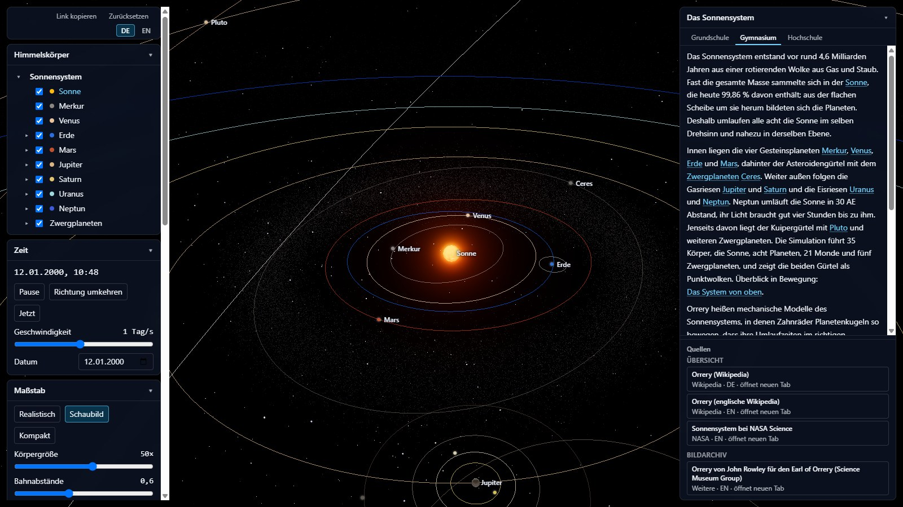
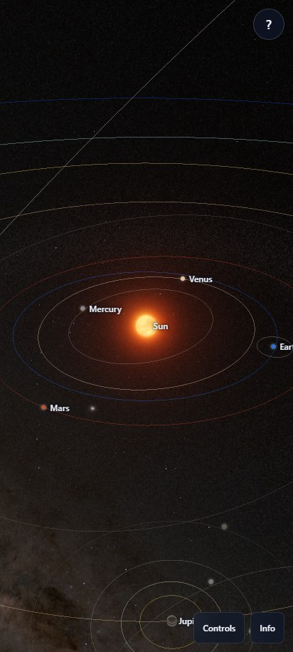
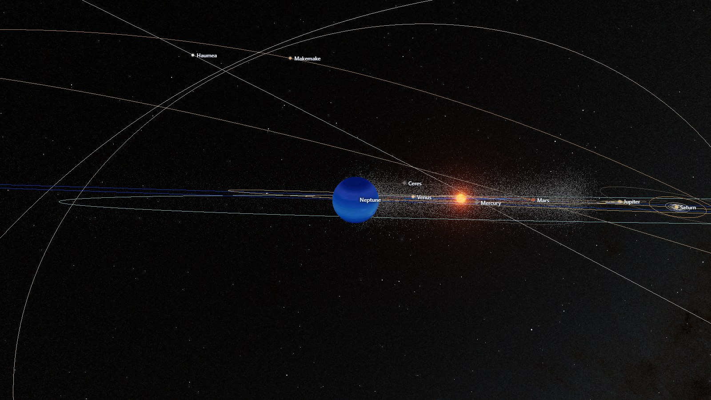

# Chronik der Entstehung

[English](chronik.en.md) | **Deutsch**

Einen verdichteten Überblick über die gesamte Entstehung bietet
[der Überblick](entstehung.de.md); diese Chronik liefert die Einzelheiten je Etappe — als
Beleg für zwei Behauptungen zugleich: Orrery als Werkzeug der Wissenschaftskommunikation,
und der hier beschriebene Arbeitsablauf als ein Weg, mit einem nicht deterministisch
arbeitenden Sprachmodell eine deterministische, überprüfbare Anwendung zu bauen.

Jede Etappe folgt demselben Aufbau: **Ziel** nennt die Absicht zu Beginn,
**Entscheidungen** die im Entwurf oder von Jens Fricke getroffenen Festlegungen,
**Ergebnis** die am Ende gemessenen Kennzahlen, **Fehler und Korrekturen** die im
Material verzeichneten Fälle samt der Prüfung, die sie fing, und **Tokens** den
Sprachmodell-Verbrauch der Etappe. Die Kürzel in Klammern und unter **Commits** sind
Commits im Repository `RTF22/Orrery` und lassen sich mit `git show <Kürzel>`
nachschlagen. Wo ein Screenshot zur Etappe passt, steht er direkt darunter, mit
Alt-Text. Eingeschobene Etappen (Klickflächen, Zeitbereich, Flug) stehen nach der
Phase, in der sie begannen, und überschneiden sich zeitlich mit Phase 4c
beziehungsweise Phase 4d.

## Inhalt

1. [Die Idee](#idee)
2. [Phase 1: Vertikaler Durchstich](#phase-1)
3. [Phase 2: Kino-Modus](#phase-2)
4. [Phase 3a: Katalog-Ausbau und Ringe](#phase-3a)
5. [Phase 3b: Gürtel und Schatten](#phase-3b)
6. [Phase 4a: Englisch und Sprachumschaltung](#phase-4a)
7. [Phase 4b: Persistenz und Ansichten](#phase-4b)
8. [Phase 4c: Infopanel](#phase-4c)
9. [Klickflächen](#klickflaechen)
10. [Zeitbereich](#zeitbereich)
11. [Flug: Tastatur, Maus und Controller](#flug)
12. [Phase 4d: Hochschultexte](#phase-4d)
13. [Nachführung nach Phase 4d](#nachfuehrung-4d)
14. [Phase 5: Oberfläche, Mobile, Texturen, Musik](#phase-5)
15. [Phase 6: Milchstraße](#phase-6)
16. [Info-Karte](#infokarte)
17. [Kleinigkeiten](#kleinigkeiten)
18. [Weg zur Domain](#domain)
19. [Anhang: Tokenbilanz](#anhang-tokens)

## Die Idee (11.09.2026)

**Ziel:** Der Ursprungsprompt an den KI-Coding-Assistenten Claude Code (Anthropic)
verlangte ausdrücklich: „starte mit dem brainstorming-Skill und interviewe mich,
bevor du planst oder Code schreibst. Stelle die Fragen einzeln, schlage jeweils eine
begründete Empfehlung vor und fasse am Ende ein Design-Dokument zusammen, das ich
freigebe. Erst danach: Implementierungsplan, dann Umsetzung in kleinen, testbaren
Schritten.“ (`docs/ursprungsprompt.md`). Dieser Ablauf — Brainstorming, Design-Dokument,
Freigabe, Plan, Umsetzung, Abnahme — zieht sich durch das ganze Projekt. Die dabei
verwendeten Skills stammen aus der Sammlung Superpowers (Plugin von Jesse Vincent).

**Entscheidungen:** Aus dem Interview zum Design-Dokument (Jens Fricke, 11.09.2026):
Orrery soll Lernwerkzeug und Showpiece gleichrangig sein; das Bahnmodell rechnet
analytisch nach Kepler, datengetrieben und gegen Referenzwerte testbar; das Repository
bleibt privat bis zur Fertigstellung, GitHub Pages ist erst zum Abschluss vorgesehen.

**Ergebnis:** Design-Dokument (`docs/superpowers/specs/2026-09-11-sonnensystem-design.md`)
und Ursprungsprompt (`docs/ursprungsprompt.md`) festgehalten, dazu die Entscheidung, das
Repository bis zur Fertigstellung privat zu halten und ohne Deployment. Zwischen dem
ersten und dem letzten dieser beiden Commits vergingen laut Zeitstempel keine drei
Minuten (19:58:18 bis 20:01:07 Uhr); die 63 dieser Etappe zugeordneten Antworten liegen
laut Tokenbilanz vollständig in der Hauptsitzung, keine davon in einem Subagentenlauf.
Noch kein Code, noch keine Tests.

**Fehler und Korrekturen:** Für diese Etappe verzeichnen die durchgesehenen Protokolle
keinen Fall — es gab noch keinen Code, der hätte scheitern können. Der erste hier
verzeichnete Fall stammt erst aus Phase 4c.

**Tokens:** 230 581 Ausgabe-Tokens, 8 843 552 Cache-Lesen-Tokens in 63 Antworten
(Kennung `idee`). Davon lagen 28 Antworten zeitlich vor dem offiziellen Beginn dieser
Phase und wurden ihr trotzdem zugeordnet, weil die Zeitleiste keine frühere Phase kennt.
Schon am 11.09.2026 liefen dazu 1 Hauptsitzung und 19 Subagentenläufe. In dieser Phase
selbst entfielen 0,0 % der Ausgabetokens auf Subagenten (63 Hauptsitzungs-, 0
Subagentenantworten); vorherrschendes Modell war hier Claude Opus 5 (100,0 % der
Ausgabetokens).
Die in den folgenden Abschnitten genannte Dauer je Etappe ist dabei die reine
Kalenderzeit zwischen erstem und letztem zugeordnetem Commit, keine gemessene
Auslastung.

**Commits:** `32072ef`, `b9e4283`.

## Phase 1: Vertikaler Durchstich (11.–12.09.2026, v0.1.0)

**Ziel:** ein lauffähiger, vertikaler Durchstich der Simulation — die vollständige
Kette von Eingabe bis Darstellung einmal durchgängig, bevor der Katalog wächst.

**Entscheidungen:** Aus derselben Interview-Runde stand die Reihenfolge der Umsetzung
fest: Durchstich zuerst, danach der Kino-Modus vorgezogen (noch vor dem
Katalogausbau), dann Katalog, dann Komfort, zuletzt Sound und Politur.

**Ergebnis:** 152 Tests in 27 Testdateien beim Abschluss, Tag `v0.1.0`. Die Etappe
lief vom Abend des 11.09.2026 (`89b0284`, 20:28 Uhr) bis in den frühen Morgen des
12.09.2026 (`bf025fd`, 07:37 Uhr) — rund 11,1 Stunden laut Zeitstempeln. Am Tag ihres
Abschlusses liefen bereits 4 Hauptsitzungen und 62 Subagentenläufe.

**Fehler und Korrekturen:** Für diese Etappe verzeichnen die durchgesehenen Protokolle keinen Fall.

**Tokens:** 1 187 833 Ausgabe-Tokens, 175 356 549 Cache-Lesen-Tokens in 1 126 Antworten
(Kennung `phase-1`; 354 Haupt-, 772 Subagentenantworten); 64,3 % der Ausgabetokens
dieser Phase entfielen auf Subagenten, vorherrschendes Modell war Claude Sonnet 5
(63,4 % der Ausgabetokens), vor Claude Opus 5 (35,7 %).

**Commits:** `89b0284`, `bf025fd`.

## Phase 2: Kino-Modus (12.09.2026, v0.2.0)

**Ziel:** ein Kino-Modus mit ausblendbarer Oberfläche, echtem Vollbild und
automatischer Kamerafahrt — laut Interview-Entscheidung vorgezogen vor den
eigentlichen Katalogausbau.

**Entscheidungen:** Für diese Etappe ist im Material kein eigener Entscheidungsblock
verzeichnet; die Reihenfolge — Kino-Modus direkt nach dem Durchstich, vor dem
Katalogausbau — folgt der bereits in der Ideen-Phase getroffenen Priorisierung
(siehe oben).

**Ergebnis:** 240 Tests in 39 Testdateien beim Abschluss, Tag `v0.2.0` (Tag-Commit
`125696f`, per Fast-Forward nach master gesetzt, zeitlich bereits nach dem Beginn von
Phase 3a). Die Etappe selbst lief komplett am Vormittag des 12.09.2026, von `a1d4c5a`
(08:10 Uhr) bis `ff68df5` (09:04 Uhr) — knapp eine Stunde (0,9 Stunden laut
Zeitstempeln).

**Fehler und Korrekturen:** Für diese Etappe verzeichnen die durchgesehenen Protokolle keinen Fall.

**Tokens:** 147 022 Ausgabe-Tokens, 51 721 718 Cache-Lesen-Tokens in 171 Antworten
(Kennung `phase-2`; alle 171 in der Hauptsitzung, keine Subagentenantwort); 0,0 % der
Ausgabetokens dieser Phase entfielen auf Subagenten, vorherrschendes Modell war Claude
Opus 5 (100,0 % der Ausgabetokens).

**Commits:** `a1d4c5a`, `ff68df5`, `125696f`.

## Phase 3a: Katalog-Ausbau und Ringe (12.–13.09.2026)

**Ziel:** den Körperkatalog auf 20 Monde und 5 Zwergplaneten erweitern und Ringe
darstellen.

**Entscheidungen:** Texturen wo verfügbar, sonst eine Ausweichfarbe; als Bezugsebene
dient der Planetenpol als Datum, Mondbahnebene, Ringebene und Achsneigung kommen
jeweils aus einer einzigen Zahl; Ringe sind beleuchtet, beidseitig sichtbar und mit
Vorwärtsstreuung gerechnet. Die Prüftiefe verlangt Invarianten über alle Szenen und
einen Rechennachweis für Stichproben — ein ausdrücklicher Wunsch des Auftraggebers.
Eingeschoben in diese Etappe war außerdem ein Zwischenschritt zu Zielbelichtung und
Albedo (Commits `bc0de15`…`a369f57`); seine inhaltlichen Entscheidungen stehen
zusammen mit denen von Phase 3b im folgenden Abschnitt.

**Ergebnis:** 689 Tests in 44 Testdateien (im nächsten Lauf bereits 721), Hauptchunk
1 096,84 kB (gzip 290,66 kB). Die Etappe dauerte laut Zeitstempeln rund 22,1 Stunden
und reichte vom 12.09.2026 (67 Commits, der commitreichste Tag der ersten drei Tage)
bis in den 13.09.2026 hinein.

**Fehler und Korrekturen:** Auch für diese Etappe verzeichnen die durchgesehenen
Protokolle keinen Fall.

**Tokens:** 4 344 979 Ausgabe-Tokens, 724 412 063 Cache-Lesen-Tokens in 3 851 Antworten
(Kennung `phase-3a`; 634 Haupt-, 3 217 Subagentenantworten); 79,4 % der Ausgabetokens
dieser Phase entfielen auf Subagenten, vorherrschendes Modell war Claude Sonnet 5
(73,9 % der Ausgabetokens), vor Claude Opus 5 (15,4 %).

**Commits:** `0a69089`, `750bef7`, `bc0de15`, `a369f57`.

## Phase 3b: Gürtel und Schatten (13.09.2026, v0.3.0)

**Ziel:** einen Asteroidengürtel und echte Schatten mit Finsternissen.

**Entscheidungen:** Der Gürtel läuft als `THREE.Points` mit Bahnrechnung im
Vertex-Shader statt als `InstancedMesh`, weil 50 000 Keplerlösungen je Bild in
JavaScript zu teuer wären. Schatten entstehen über analytische Okkluder statt
Shadow-Maps, wegen der großen Maßstabsspanne, logarithmischer Tiefe und eines exakten
Halbschattens aus Kreisüberlappung. Die Belichtung richtet sich nach dem Kamera-Ziel
statt nach einer festen Kamera, Albedo ist ein Katalogdatum je Körper, Sonne und
Sterne bleiben von der Belichtung unberührt.

**Ergebnis:** Tag `v0.3.0` (Tag-Commit `515f4fe`, 17:46 Uhr). Rund 46 Minuten danach,
um 18:32 Uhr, wurde das Projekt in „Orrery“ umbenannt (`6d3409b`). Eine eigene Testzahl
oder ein eigener Hauptchunk-Wert für diese Etappe ist in den Kennzahlen nicht gesondert
ausgewiesen (die nächste verzeichnete Zahl gehört bereits zu Phase 4a). Die Etappe
dauerte laut Zeitstempeln rund 8,7 Stunden, ganz am 13.09.2026 — dem Tag mit
7 Hauptsitzungen und 68 Subagentenläufen, an dem auch Phase 3a endete und Phase 4a
begann. Bis zum Ende dieses dritten Tages waren nach der Zeitleiste bereits 147 der
insgesamt 673 Commits bis zum Projektabschluss entstanden (18 am 11.09., 67 am 12.09.,
62 am 13.09.).

**Fehler und Korrekturen:** Für diese Etappe verzeichnen die durchgesehenen Protokolle
ebenfalls keinen Fall.

**Tokens:** 1 435 858 Ausgabe-Tokens, 204 267 920 Cache-Lesen-Tokens in 1 539 Antworten
(Kennung `phase-3b`; 324 Haupt-, 1 215 Subagentenantworten); 74,8 % der Ausgabetokens
dieser Phase entfielen auf Subagenten, vorherrschendes Modell war Claude Opus 5
(36,9 % der Ausgabetokens), vor Claude Sonnet 5 (36,4 %).

**Commits:** `d94c497`, `515f4fe`, `6d3409b`, `69e9998`.

## Phase 4a: Englisch und Sprachumschaltung (13.09.2026)

**Ziel:** Die Oberfläche zur Laufzeit auf Englisch umschaltbar machen, ohne ein
externes i18n-Framework einzuführen.

**Entscheidungen:** Von Jens Fricke am 13.09.2026 festgelegt: Die Startsprache
richtet sich automatisch nach `navigator.language` (beginnt der Wert mit „en“,
startet die App englisch); statt eines Frameworks entstand eine eigene, kleine
Lösung; die englische Locale ist `en-GB` (Tag vor Monat, 24-Stunden-Uhr).

**Ergebnis:** 848 Tests in 54 Testdateien, Hauptchunk 1 120,22 kB (gzip
298,40 kB). Die Etappe lief komplett am 13.09.2026, von `6a565c1` (20:12 Uhr)
bis `41c0127` (21:25 Uhr) — rund 1,2 Stunden. Ein eigener Git-Tag ist für diese
Etappe nicht vergeben; sie zählt zum späteren Tag `v0.4.0`.

**Fehler und Korrekturen:** Für diese Etappe verzeichnen die durchgesehenen
Protokolle keinen Fall.

**Tokens:** 463 002 Ausgabe-Tokens, 66 461 714 Cache-Lesen-Tokens in 519
Antworten (Kennung `phase-4a`; 100 Haupt-, 419 Subagentenantworten); 72,2 % der
Ausgabetokens dieser Phase entfielen auf Subagenten, vorherrschendes Modell war
Claude Sonnet 5 (68,0 % der Ausgabetokens), vor Claude Fable 5.1 (27,8 %).

**Commits:** `6a565c1`, `41c0127`.

## Phase 4b: Persistenz und Ansichten (14.09.2026)

**Ziel:** Zustände über Sitzungen hinweg erhalten — geteilte Links, gemerkte
Sitzung und gespeicherte Ansichten — statt jedes Mal beim Standardzustand zu
beginnen.

**Entscheidungen:** Von Jens Fricke am 14.09.2026 festgelegt: zwei Etappen,
zuerst Prüfer, Profile, Sitzung, Link und Zurücksetzen, danach ein eigenes
Panel „Ansichten“ mit Export und Import; die Sitzung wird automatisch und
entprellt gesichert, die Checkbox „Sitzung merken“ ist standardmäßig an; die
Adresszeile bleibt sauber, nur der Knopf „Link kopieren“ erzeugt das
URL-Fragment.

**Ergebnis:** Nach Etappe 1 58 Testdateien und Hauptchunk 1 125,99 kB (gzip
300,42 kB), am Ende der Etappe 59 Testdateien und Hauptchunk 1 134,38 kB (gzip
302,88 kB). Die gesamte Etappe lief am Vormittag des 14.09.2026, von `f18d527`
(07:08 Uhr) bis `3dee118` (10:10 Uhr) — rund 3,0 Stunden.

**Fehler und Korrekturen:** Auch für diese Etappe verzeichnen die durchgesehenen
Protokolle keinen Fall.

**Tokens:** 881 748 Ausgabe-Tokens, 103 360 297 Cache-Lesen-Tokens in 903
Antworten (Kennung `phase-4b`; 234 Haupt-, 669 Subagentenantworten); 60,0 % der
Ausgabetokens dieser Phase entfielen auf Subagenten, vorherrschendes Modell war
Claude Sonnet 5 (45,7 % der Ausgabetokens), vor Claude Fable 5.1 (40,0 %).

**Commits:** `f18d527`, `3dee118`.

## Phase 4c: Infopanel (14.–17.09.2026, v0.4.0)

**Ziel:** Ein Infopanel mit kuratierten Quellenkarten und gestaffelten
Textstufen je Körper und Thema, dazu Szenentexte und eine Kamerafahrt.

**Entscheidungen:** Von Jens Fricke am 14.09.2026 festgelegt: keine Einbettung
fremder Seiten, kuratierte Quellenkarten öffnen stattdessen im neuen Tab; die
Reiter im Panel sind die Niveaustufen Grundschule, Gymnasium und Hochschule und
schalten den Text um; die Textlänge ist gestaffelt (Grundschule 40 bis 80,
Gymnasium 120 bis 180 Wörter, Hochschule ohne Obergrenze) — die Hochschulstufe
wird hier nur technisch eingebaut, gefüllt wird sie erst in Phase 4d.

**Ergebnis:** Der Quellenkatalog wuchs von 24 Einträgen (Etappe 1) über 62
(Etappe 3) auf 66 am Ende von Phase 4c; die Testzahl stieg parallel von 1126
(Etappe 1) über 1536 (Etappe 2) und 1940 (Etappe 3, Hauptchunk 1 195,59 kB,
gzip 317,66 kB) auf 2892 Tests in 82 Testdateien am Ende. Die Etappe reichte
vom 14.09.2026 (`022dee6`, 13:25 Uhr) bis in die Nacht zum 17.09.2026
(`ddccc3a`, 00:16 Uhr) — rund 58,8 Stunden — und schloss mit dem Tag `v0.4.0`
ab (Tag-Commit identisch mit dem letzten Commit der Etappe; das Tag-Objekt
selbst trägt ein Erstelldatum rund acht Stunden später, 08:17 Uhr desselben
Tages).

**Fehler und Korrekturen:** Die Grundschultexte wichen zunächst vom
freigegebenen Plan ab: `objekt-phobos` nannte eine Aufgangszahl statt der
Umlaufaussage, `thema-ringe` gab die Ringbreite als „über 250 000 km“ (das ist
der Durchmesser) statt „200 000 km breit“ an, `objekt-makemake` verglich
Makemake mit Pluto als „gut halb so groß“ statt „zwei Drittel“ — gefangen durch
die Fachprüfung, korrigiert in einer Fix-Welle, die 15 Grundschultexte wörtlich
auf den Planstand brachte.

**Tokens:** 3 987 747 Ausgabe-Tokens, 539 796 022 Cache-Lesen-Tokens in 3 370
Antworten (Kennung `phase-4c`; 810 Haupt-, 2 560 Subagentenantworten); 62,4 %
der Ausgabetokens dieser Phase entfielen auf Subagenten, vorherrschendes Modell
war Claude Sonnet 5 (47,5 % der Ausgabetokens), vor Claude Opus 5 (35,5 %).

**Commits:** `022dee6`, `70e1c4c`, `c8bb17b`, `ddccc3a`.

## Klickflächen (15.09.2026)

**Ziel:** Körper, Namen und Bahnen im Bild direkt anklickbar machen, statt nur
über Listen erreichbar.

**Entscheidungen:** Laut Abnahmeprotokoll hat Jens am 15.09.2026 entschieden,
dass ein erneuter Klick auf das bereits gewählte Kameraziel dieses wieder
anfährt (der Zoom-Reset-Effekt ist gewollt) und dass Klicks in der dichten
Systemansicht auch eine Bahn statt „ins Leere“ treffen dürfen: „Es bleibt
dabei.“

**Ergebnis:** 2003 Tests in 81 Testdateien. Die Etappe lief am Nachmittag des
15.09.2026, von `ebc5abc` (16:10 Uhr) bis `e9e78c0` (19:28 Uhr) — rund 3,3
Stunden — und überschneidet sich zeitlich mit Phase 4c.

**Fehler und Korrekturen:** Ein Klick auf einen nur durch Hover sichtbaren
Namen traf zunächst nichts oder das falsche Ziel, weil `pointerdown` sofort
`onZeiger(null)` meldete und der Name schon vor `pointerup` verschwand —
gefangen durch die Fachprüfung, behoben, indem die Hervorhebung bei Maus und
Stift während des Drucks stehen bleibt und `onZeiger(null)` erst ab einer
Tippschwelle, einem zweiten Zeiger, `pointercancel` oder `pointerleave`
ausgelöst wird (Commit `bda469d`). In der Systemansicht ordnete ein Klick auf
Mars stattdessen dem Mond Deimos zu, weil bei extremer Abstandskompression
Rang 1 nach Tiefe statt nach Nähe zur Zeigermitte wählte — gefangen durch
Pixelmessung, behoben mit einem eigenen Feld `glyphe` je Scheibe und einer
zweistufigen Rangfolge (Commit `6b43f0c`).

**Tokens:** 984 680 Ausgabe-Tokens, 98 857 888 Cache-Lesen-Tokens in 717
Antworten (Kennung `klickflaechen`; 114 Haupt-, 603 Subagentenantworten);
78,7 % der Ausgabetokens dieser Phase entfielen auf Subagenten,
vorherrschendes Modell war Claude Sonnet 5 (59,7 % der Ausgabetokens), vor
Claude Opus 5 (34,9 %).

**Commits:** `ebc5abc`, `bda469d`, `6b43f0c`, `e9e78c0`.

## Zeitbereich (19.09.2026)

**Ziel:** Einen in Phase 4d gefundenen Absturz beheben — bei linear
fortgeschriebener Bahnrechnung wurde ab dem Jahr 12 563 Saturns
Bahnexzentrizität rechnerisch negativ, der Keplerlöser warf einen Fehler und
die Bildschleife blieb dauerhaft stehen, gefangen durch die Fachprüfung
während Phase 4d — und dafür mit Commit `6566e32` einen festen Zeitbereich vom
1. Januar 1 bis zum 31. Dezember 9999 einführen.

**Entscheidungen:** Aus den Rulings der Umsetzung — einzelnen, während der laufenden
Umsetzung selbst getroffenen und begründeten Entscheidungen anstelle einer Rückfrage
an Jens —: Das Datumsfeld zeigt Jahre
außerhalb von 1 bis 9999 bewusst leer statt eines ungültigen Werts; die
Untergrenze bleibt der Julianische Tag 0 (Jahr 1), wie von Jens gewählt; vor
dem Merge lief eine eigene Fix-Welle für die Anzeige vor Christus, das
Datumsfeld bei Jahren 1 bis 99 und die Fehlermeldung nach einer Erholung vom
Absturz.

**Ergebnis:** 3689 Tests in 93 Testdateien (Endstand nach der Nacharbeit). Die
Etappe lief am Vormittag des 19.09.2026, von `ccb398c` (09:57 Uhr) bis
`4b77caf` (11:09 Uhr) — rund 1,2 Stunden — und überschneidet sich zeitlich mit
Phase 4d.

**Fehler und Korrekturen:** Das Datumsfeld selbst schnitt `toISOString()` auf
zehn Zeichen zu; bei negativem Jahr fehlte darin der Tag, der Browser verwarf
den Wert und das Feld blieb leer — gefangen durch die Fachprüfung, behoben mit
der reinen Funktion `jdZuDatumsfeld` in `src/ui/format.ts` (Commit `46c7319`).

**Tokens:** 365 863 Ausgabe-Tokens, 89 041 341 Cache-Lesen-Tokens in 552
Antworten (Kennung `zeitbereich`; 70 Haupt-, 482 Subagentenantworten); 82,2 %
der Ausgabetokens dieser Phase entfielen auf Subagenten, vorherrschendes
Modell war Claude Sonnet 5 (70,9 % der Ausgabetokens), vor Claude Opus 5
(29,1 %).

**Commits:** `ccb398c`, `6566e32`, `46c7319`, `4b77caf`.

## Flug: Tastatur, Maus und Controller (19.09.2026)

**Ziel:** Freies Fliegen durch die Szene mit Tastatur und Maus (Etappe 1)
sowie mit einem Xbox-Controller samt Fadenkreuz (Etappe 2).

**Entscheidungen:** Von Jens Fricke am 19.09.2026 festgehalten: „Mach alles
wie empfohlen“ — die Regel aus §13.5 des Entwurfs bleibt bestehen; das Kino
darf im Fenster laufen, wenn Chrome das Vollbild verweigert; rechter Stick und
die Taste R3 brechen keine laufende Kamerafahrt mehr ab, und eine
Wiederherstellung wird auch während eines laufenden Flugs erkannt.

**Ergebnis:** Nach Etappe 1 3769 Tests in 98 Testdateien, Hauptchunk
1 291,02 kB (gzip 346,93 kB); nach Etappe 2 3832 Tests in 101 Testdateien,
Hauptchunk 1 299,03 kB (gzip 349,86 kB). Die gesamte Etappe lief am
Nachmittag des 19.09.2026, von `691a0ab` (12:45 Uhr) bis `78e6f1d` (18:15 Uhr)
— rund 5,5 Stunden — und überschneidet sich zeitlich mit Phase 4d.

**Fehler und Korrekturen:** Beim Flugstart verglich die Kamera die gerade
gezeigte Lage mit der im selben Bild bereits bewegten Solllage, hielt das für
eine Wiederherstellung und dämpfte mit 0,45 statt der vorgesehenen 0,15
Sekunden — gefangen durch die Fachprüfung, behoben, indem die Flugfunktion im
Eintrittsbild sofort zurückkehrt und der eigentliche Flugschritt erst ein Bild
später beginnt.

**Tokens:** 2 107 770 Ausgabe-Tokens, 278 589 820 Cache-Lesen-Tokens in 1 549
Antworten (Kennung `flug`; 274 Haupt-, 1 275 Subagentenantworten); 74,0 % der
Ausgabetokens dieser Phase entfielen auf Subagenten, vorherrschendes Modell
war Claude Sonnet 5 (51,1 % der Ausgabetokens), vor Claude Opus 5 (48,9 %).

**Commits:** `691a0ab`, `78e6f1d`.

## Phase 4d: Hochschultexte (17.–23.09.2026, v0.5.0)

**Ziel:** Neben Grundschule und Gymnasium eine dritte, unbegrenzte Textstufe
„Hochschule“ mit Formeln, Tabellen und Primärliteratur füllen — in elf Etappen
(4d-1 bis 4d-11) je Körper- oder Fachthemengruppe. Kernregel aus dem Entwurf:
„jede Literaturangabe ist maschinell gegen Crossref beziehungsweise arXiv und
inhaltlich gegen die zitierte Arbeit geprüft“; Werkzeug `scripts/pruefe-literatur.ts`,
aufgerufen über `npm run literatur:pruefen`.

**Entscheidungen:** Ablauf je Text: schreiben → `npm test` und
`npm run literatur:pruefen -- --nur <neue Kennungen>` → gemeinsamer Commit von Text,
Fassung, Belegliste und Katalogeinträgen → eine Fachprüfung, im Fehlerfall eine
Nacharbeit mit eigenem Commit; weitere Prüfrunden kamen nur vereinzelt vor, offen
gebliebene Befunde wurden sonst vorgemerkt (siehe 4d-3, 4d-5, 4d-7). Für die ganze
Phase galt außerdem: ein Umsetzer gleichzeitig, Rulings statt Rückfragen während
eines laufenden Plans, jede Entscheidung mit Begründung festgehalten und gesammelt an Jens, und
Kommentare im Code sind kein Beleg — das bestätigten mehrere Etappen an eigenen
Fällen (unten). Jede der elf Etappen hatte einen eigenen Plan, eigene Commits und
ein eigenes Abnahmeprotokoll.

### 4d-1: Pilottexte (17.09.2026)

Die ersten beiden Hochschultexte, `thema-bahnelemente` und `objekt-earth`, liefen
als Pilot und wurden mit Commit `f0963a0` abgenommen. Dabei traten gleich drei
Fälle auf: `thema-bahnelemente`
schrieb den vier äußeren Uranusmonden pauschal „über 40 Jahre keinen
belastbaren linearen Trend“ zu; das traf nur auf zwei von ihnen zu, einziger
Beleg für die Pauschalaussage war ein falscher Kommentar in `uranus-monde.ts`
— gefangen durch die Fachprüfung, mit Commit `a21082a` richtiggestellt.
Derselbe Text schrieb die Herkunft der Mondraten pauschal „JPL“ zu, obwohl die
Umlaufzeit selbst aus der siderischen Periode stammt — ebenfalls durch die
Fachprüfung gefangen, in einer zweiten, gesondert dokumentierten Prüfrunde mit Commit
`dc36107` berichtigt. `objekt-earth` verwechselte den Beginn eines
Messzeitraums (1972) mit dem Beginn des physikalischen Effekts selbst —
gefangen durch die Fachprüfung, richtiggestellt mit Commit `4e5d336`.

### 4d-2: Fachthemen (17.–19.09.2026)

Themen unabhängig von einzelnen Körpern, unter anderem Innerer Aufbau, Albedo
und Helligkeit, Entstehung des Sonnensystems (Commits `2db1043`…`2008eed`),
abgenommen mit `6a76e77`/`b24fc6a`. In dieser Etappe fand die Fachprüfung den bei
[Zeitbereich](#zeitbereich) beschriebenen Kepler-Absturz: Bei linear
fortgeschriebener Bahnrechnung wird Saturns Exzentrizität ab dem Jahr 12 563
rechnerisch negativ, der Keplerlöser wirft einen Fehler, die Bildschleife bleibt
stehen. Der Fund selbst gehört zu 4d-2, seine Behebung lief als eigene,
eingeschobene Etappe.

### 4d-3: Sonne, Erde-Mond-System (19.–20.09.2026)

Commits `87320bb`…`512ad5b` (abgenommen `2df3430`/`512ad5b`). Zwei Fälle zeigen,
wie unterschiedlich Prüfungen ausgehen: Beim Thema gebundene Rotation ergab das
Modell für Tethys eine Librationsperiode von 57,8 statt der erwarteten 1,89 Tage
— rund Faktor 30 —, die Fachprüfung hielt das fest, ohne den Code zu ändern; der
Befund ging als Vormerkung in den späteren Tethys-Körpertext (Etappe 4d-7). Bei
der Szene „Sonnenaufgang über dem Erdrand“ irrte zunächst die Prüfung selbst: Eine
erste Rechnung kam wegen eines eigenen Vorrundungs- und Vorzeichenfehlers auf
+0,5 statt +5,275 ppm GM⊕-Abweichung; erst eine zweite, unabhängige Rechnung
bestätigte den ursprünglichen Umsetzerwert.

### 4d-4: Innere Planeten (20.09.2026)

Commits `7fcea01`…`1059282`, an einem Tag umgesetzt und abgenommen. Für diese
Etappe sind keine Fehlerfälle überliefert.

### 4d-5: Jupitersystem (20.–21.09.2026)

Commits `fcf9845`…`df715ff`. `objekt-europa` verwechselte an einer Stelle zwei
unterschiedliche physikalische Größen (Kippwinkel „wie bei Io“), gefangen durch
die Fachprüfung und in der Nacharbeit richtiggestellt. Ein zweiter Befund blieb
dagegen offen: Ein Kommentar in `scenes.ts` zur Szene „galileisches
Schattenspiel“ behauptet, Kallistos Bahn rage „gelegentlich“ über den Bildrand —
gefangen durch die Fachprüfung, deren vollständige geometrische Nachrechnung
52,4 % aller Ziehungen ergab; der Text folgt der eigenen Rechnung, der
Kommentar blieb unverändert.

### 4d-6: Saturn und Ringe (21.–22.09.2026)

Commits `c74c4b4`…`53a1d63` (abgenommen `dde8291`/`53a1d63`). Für diese Etappe
sind keine Fehlerfälle überliefert.

### 4d-7: Mittlere Saturnmonde (22.09.2026)

Commits `e227ac2`…`f3d579b`. Auch hier erwies sich ein Code-Kommentar als
unbelegt: Zur Szene „Iapetus schief“ behauptet `scenes.ts`, `distanceInRadii: 40`
zeige „Iapetus' vollständige, klar geneigte Bahnellipse komfortabel im Bild“ —
gefangen durch die Fachprüfung, deren eigener Frustumtest tatsächlich nur 5 bis
31 von 72 Stützpunkten im Bild zeigte. Auch dieser Befund blieb ohne
Codeeingriff als Vormerkung im Protokoll stehen.

### 4d-8: Uranussystem (22.09.2026)

Commits `7dacecb`…`0a8b584`. `objekt-umbriel` verwechselte an einer Fundstelle
Ariels große Halbachse mit ihrer Exzentrizität, gefangen durch die Fachprüfung
und in der Nacharbeit richtiggestellt.

### 4d-9: Neptun, Pluto (23.09.2026)

Abgenommen mit `4e39a04`. `objekt-pluto` und das fachgeprüfte Grundlagenthema
`thema-achsneigung` schrieben Plutos „chaotische“ Achsschiefe fälschlich
Dobrovolskis und Harris 1983 zu; die Arbeit beschreibt tatsächlich eine stabile
Oszillation. `objekt-pluto` wurde noch in der Etappe berichtigt; für
`thema-achsneigung` verbot die Regel „keine Änderung fachgeprüfter Texte in
dieser Etappe“ zunächst eine Korrektur, die Entscheidung blieb bei Jens. Er traf
sie noch am selben Tag: Commit `63d3144` (23.09.2026, 06:32 Uhr) berichtigte
`thema-achsneigung` in beiden Sprachen samt Belegliste. Die Gesamtabnahme von
Phase 4d vermerkte diese Korrektur an einer Stelle, führte die Zuschreibung an
anderer Stelle aber weiter als offen — ein Widerspruch im eigenen Protokoll, den
der erste Entwurf dieses Abschnitts übernahm, bis die Prüfung dieses
Chronik-Teils ihn direkt am Commit selbst fand.

### 4d-10: Zwergplaneten (23.09.2026)

Abgenommen mit `5bed033`: Eine Fachprüfung fing hier vier Zuschreibungsfehler
auf einmal. Bei `objekt-eris` wurde die
Dämpfungsgröße Q/k₂ = 3200 fälschlich der frequenzabhängigen statt der
konstanten Dämpfung zugeschrieben, und der Dysnomia-Radius von 350 km fälschlich
einer Arbeit von 2023 statt der tatsächlichen Quelle von 2018. Bei
`objekt-makemake` wurde ein D/H-Wert von 3,98·10⁻⁴ fälschlich der Gasphase statt
dem Methaneis zugeschrieben; ein Kommentar in `zwergplaneten.ts` schrieb
Makemakes Kippwinkelspanne zudem der falschen Arbeit zu (Hromakina statt Parker
et al. 2016) — im Text richtiggestellt, der Kommentar blieb unverändert.

### 4d-11: Abschluss (23.09.2026, v0.5.0)

Die letzten Themen (`modell`, `sonnensystem`) und die Szene `systemblick`
schlossen den Hochschulkorpus ab; der Dateitest verlangt seither keinen
Gymnasialersatz mehr. Commit `ce8cf95` setzte den Tag `v0.5.0` und schloss
zugleich die Gesamtabnahme der Phase ab. Diese Gesamtabnahme fand fünf weitere
Restbefunde — eine zu niedrige Driftrate des Großen Roten Flecks, eine zu große
Abweichung im Gymnasialtext `thema-modell`, Prozesssprache in Beleglisten, eine
veraltete Notiz in einer Prüfspalte und drei unmaskierte Trennstriche — und
verwies sie in die anschließende Etappe
[Nachführung nach Phase 4d](#nachfuehrung-4d).

**Fehler und Korrekturen:** Zu dieser Phase zählen insgesamt 20 verzeichnete
Fehlerfälle (der unter [Zeitbereich](#zeitbereich) beschriebene Kepler-Absturz
kommt gesondert hinzu und wird dort behandelt) — fünfzehn davon stehen oben bei
ihrer Etappe, fünf weitere fand erst die Gesamtabnahme; sie sind bei
[Nachführung nach Phase 4d](#nachfuehrung-4d) beschrieben.

**Ergebnis:** Am Ende von 4d-1 standen 6 Textdateien, 3537 Tests, 51
Katalogeinträge, 80 Quellenkarten und ein Hauptchunk von 1 243,77 kB; am Ende der
Phase (4d-11) waren es 5150 Tests, 761 Katalogeinträge, 91 Quellenkarten und
1 453,78 kB, bei insgesamt 138 Hochschuldateien (69 deutsch, 69 englisch). Die
deutschen Texte kommen zusammen auf 151 719 Wörter (Mittel 2199 je Datei), die
englischen auf 167 219 (Mittel 2423) — macht 318 938 Wörter Hochschulkorpus. Der
Literaturkatalog wuchs auf 761 Einträge, 761 verschiedene, maschinell gegen
Crossref oder arXiv geprüfte Zitate. Die Phase lief laut Zeitstempeln rund 152,9
Stunden, vom 17.09.2026 (`5707089`) bis zum 23.09.2026 (`ce8cf95`).

**Tokens:** 23 807 582 Ausgabe-Tokens, 7 178 734 109 Cache-Lesen-Tokens in
24 905 Antworten (Kennung `phase-4d`; 2 254 Haupt-, 22 651 Subagentenantworten);
87,9 % der Ausgabetokens dieser Phase entfielen auf Subagenten, vorherrschendes
Modell war Claude Sonnet 5 (54,9 % der Ausgabetokens), vor Claude Opus 5
(38,1 %).

**Commits:** `5707089`, `f0963a0`, `4e39a04`, `5bed033`, `ce8cf95`.

## Nachführung nach Phase 4d (23.09.2026)

**Ziel:** Die von der Gesamtabnahme gefundenen Restbefunde aus Phase 4d
abarbeiten, bevor Phase 5 beginnt: die Driftrate des Großen Roten Flecks, eine
Abweichung im Gymnasialtext `thema-modell`, Prozesssprache in Beleglisten und ein
technisches Zeichenproblem.

**Entscheidungen:** Der fachgeprüfte Hochschultext `objekt-jupiter` durfte
ausnahmsweise geändert werden — eine ausdrückliche Entscheidung vom 23.09.2026
gegen die sonst geltende Regel, fachgeprüfte Texte in späteren Etappen nicht mehr
anzufassen. Die mechanische Bereinigung der Prozesssprache wurde auf zwei Tasks
(einzeln vergebene Arbeitsschritte) für das kleinste eingesetzte Modell
aufgeteilt — das reichte am Ende nicht,
beide Versuche mussten nachgearbeitet werden (siehe unten).

**Fehler und Korrekturen:** Commit `a323c80` berichtigte zwei der von der
Gesamtabnahme gefundenen Fälle: Die Westwärtsdrift des Großen Roten Flecks stand
in einem Hochschultext mit „rund 0,026° je Tag“ statt „rund 0,26° je Tag“ —
Faktor 10 zu klein —, und der Gymnasialtext `thema-modell` nannte die Abweichung
zwischen Erde-Mond-Schwerpunkt und Erdmittelpunkt mit „unter 4700 km“, obwohl der
fachgeprüfte Maximalwert bei 4928 km liegt; auf „rund 4400 bis 4900 km“
berichtigt. Die Prozesssprache selbst betraf 27 Beleglisten (rund 230 Treffer in
40 Dateien bei breiter Suche) und wurde zum Lehrstück über das kleinste Modell:
Der erste Bereinigungscommit ließ 37 regelgedeckte Treffer stehen, statt sie
vollständig zu entfernen — gefangen durch die Controller-Prüfung, eine
grepbasierte Durchsicht vor der eigentlichen Fachprüfung; ein weiterer Commit
erreichte danach 0 Treffer (Commits `5c27397`/`8989c69`). Ein zweiter Versuch
auf einem Hilfsbranch (`sicherung-task3-haiku`, Commit `d25d58f`) schoss übers
Ziel hinaus: Er strich „(Runde 1)“ in rund 15 unbeteiligten Beleglisten und
löschte Hinweisnummern ersatzlos — ebenfalls durch die Controller-Prüfung
gefangen, der Versuch wurde verworfen, der Branch zurückgesetzt, und die Etappe
danach zusammen mit der Nacharbeit von Teil A auf dem mittleren Modell
wiederholt. Eine dritte Bereinigung verlor dabei
außerdem Modellzahlen in `objekt-ganymede.md` sowie Befundnummern in
`objekt-jupiter.md` und `objekt-mars.md` — von der Fachprüfung gefangen und mit
Commit `b6558f6` wiederhergestellt. Ein drittes technisches Problem betraf drei
Beleglisten-Zeilen mit einem unmaskierten Trennstrich `|`, die eine erste, naive
Zellenzählung fälschlich als 51 „falsche Zellenzahlen“ im ganzen Korpus meldete;
sie wurden in derselben Etappe maskiert, inhaltlich blieben die Zeilen
unverändert. Eine fünfte Randnotiz der Gesamtabnahme erwies sich als reiner
Buchhaltungsbefund: Die Prüfspalte zu `objekt-neptune.md` hielt eine
Sprachmischung für ungeklärt, die seit Etappe 4d-9 bereits korrekt war — die
Spalte selbst blieb unnachgeführt. Zuletzt musste sich die Etappe auch mit der
eigenen Vorgängerin auseinandersetzen: Die Gesamtabnahme von Phase 4d hatte drei
Gymnasialbefunde (Uranus-Sonnenwende „2028“ statt 2030, die Höhe von Verona
Rupes, Titania/Oberon-Anteile) als weiterhin offen gemeldet, obwohl alle drei
schon seit Commit `44b760c` vom 22.09.2026 behoben waren — ein späterer Task
stellte das richtig, ohne das ursprüngliche Protokoll erneut zu ändern. Die Lehre
daraus zog Jens für die nächste Phase: Ähnlich gelagerte, regelgebundene
Bereinigungen starten seither gleich auf dem mittleren statt zuerst auf dem
kleinsten Modell.

**Ergebnis:** Tests, Katalog und Hauptchunk blieben unverändert bei 5150 Tests,
761 Katalogeinträgen, 91 Quellenkarten und 1 453,78 kB — die Etappe änderte Text-
und Prozessinhalte, keinen Code. Sie lief laut Zeitstempeln rund eine Stunde, am
23.09.2026 von `218b1f7` (17:42 Uhr) bis `c0b39fb` (18:41 Uhr).

**Tokens:** 234 231 Ausgabe-Tokens, 81 737 072 Cache-Lesen-Tokens in 604
Antworten (Kennung `nachfuehrung-4d`; 121 Haupt-, 483 Subagentenantworten);
48,8 % der Ausgabetokens dieser Phase entfielen auf Subagenten, vorherrschendes
Modell war Claude Opus 5.5 (51,2 % der Ausgabetokens), vor Claude Sonnet 5
(33,5 %).

**Commits:** `218b1f7`, `a323c80`, `8989c69`, `b6558f6`, `c0b39fb`.

## Phase 5: Oberfläche, Mobile, Texturen, Musik (23.–25.09.2026, v0.6.0)

**Ziel:** Nach Phase 4d in vier funktionalen Etappen weiterbauen — 5-1 Oberfläche,
5-2 Mobile, 5-3 Texturen und Laden, 5-4 Musik — und mit Etappe 5-5 abschließen.

**Entscheidungen:** Die Gesamtabnahme der Phase (Jens Fricke, 25.09.2026) hielt die
Handprüfung ohne Befund fest; Tag `v0.6.0` wurde gesetzt und nach `master` gepusht.
Sie bestätigte zugleich die schon bei der Nachführung nach Phase 4d gezogene Lehre
zur Modellwahl bei regelgebundenen Bereinigungen (siehe oben).

**Ergebnis:** Tests und Hauptchunk wuchsen von Etappe zu Etappe: 5-1 5174 Tests
(1 456,56 kB), 5-2 5192 Tests (1 458,08 kB), 5-3 nach Nacharbeit 5235 Tests
(1 523,15 kB), 5-4 5275 Tests, Endstand (`de97203`) 5285 Tests bei unverändertem
Hauptchunk 1 529,67 kB. Etappe 5-3 senkte die 1k-Texturensumme auf 3 567 420 Bytes
(Ziel unter 4 000 000 Bytes) und, nach einer Korrektur (`63edc93`), die Ladezeit im
simulierten „Fast 4G“ auf 4 543,6 ms im Median (Ziel höchstens 5 000 ms) — bei einem
Repositoryzuwachs von rund 170 MiB für die neuen Texturstufen (KTX2-Gesamtsumme
177 914 750 Bytes). Die Phase lief laut Zeitstempeln rund 36,3 Stunden, vom
23.09.2026 (`d326970`, 20:00 Uhr) bis zum 25.09.2026 (`d0e88f5`, 08:21 Uhr).

**Fehler und Korrekturen:** In Etappe 5-2 lehnte `npm run build` (`tsc -b`) den
literalen Import `readFileSync` aus `node:fs` in `konstanten.test.ts` ab (TS2591) —
gefangen durch den Build, im selben Task behoben. In Etappe 5-3 verglich
`texturen-bauen.ts` bei der 1k-Summe wörtlich `breite === 1024` statt der
Konstante `ETC1S_BREITE` — gefangen durch die Fachprüfung, in der Nacharbeit
richtiggestellt (Commit `257750a`).

**Tokens:** 1 386 592 Ausgabe-Tokens, 413 032 693 Cache-Lesen-Tokens in 2 784
Antworten (Kennung `phase-5`; 534 Haupt-, 2 250 Subagentenantworten); 56,6 % der
Ausgabetokens dieser Phase entfielen auf Subagenten, vorherrschendes Modell war
Claude Sonnet 5 (53,5 % der Ausgabetokens), vor Claude Opus 5.5 (43,4 %).

**Commits:** `d326970`, `626dba1`, `c2d871e`, `1c53656`, `d0e88f5`.

## Phase 6: Milchstraße (25.09.2026, v0.7.0)

**Ziel:** Die Milchstraße im Hintergrund der Szene ergänzen.

**Entscheidungen:** Aus der Gesamtabnahme (Jens Fricke, 25.09.2026): Das gemessene
Kohlensack-Kontrastverhältnis von 0,707 blieb trotz des Zielwerts unter 0,6
akzeptiert, die Helligkeitskurve unverändert. Die Handprüfung bestand, Tag `v0.7.0`
wurde gesetzt, nach `master` gepusht und auf den Webspace ausgerollt.

**Ergebnis:** Tests stiegen von 5301 auf 5328, der Hauptchunk von 1 529,67 kB auf
1 531,36 kB. Die drei Texturstufen der Milchstraße liegen bei 59 941 Bytes (1k),
1 069 543 Bytes (2k) und 30 310 600 Bytes (8k). Die Etappe lief laut Zeitstempeln
rund 3,4 Stunden, am 25.09.2026 von `02bb097` (08:45 Uhr) bis `a576b7b` (12:10 Uhr);
der Tag-Commit `8d1b268` (11:56 Uhr) liegt dazwischen.

**Fehler und Korrekturen:** Der Gaia-Anteil der Milchstraßen-Quelle war im Entwurf
mit der Lizenz CC BY-SA angenommen; tatsächlich gilt CC BY-NC 3.0 IGO
(nichtkommerziell, genehmigungspflichtig) — gefangen durch die Fachprüfung, behoben
mit einem NC-Vermerk auf der Quellenkarte und einer Nachführung des Entwurfs (Orrery
ist nichtkommerziell).

**Tokens:** 352 026 Ausgabe-Tokens, 136 374 213 Cache-Lesen-Tokens in 644 Antworten
(Kennung `phase-6`; 125 Haupt-, 519 Subagentenantworten); 59,3 % der Ausgabetokens
dieser Phase entfielen auf Subagenten, vorherrschendes Modell war Claude Sonnet 5
(56,0 % der Ausgabetokens), vor Claude Opus 5.5 (40,7 %).

**Commits:** `02bb097`, `8d1b268`, `a576b7b`.

## Info-Karte (25.09.2026, v0.7.1)

**Ziel:** Eine Info-Karte mit den Reitern Einrichtung, Bedienung und Über einführen,
dazu eine eigene Karte Steuerung.

**Entscheidungen:** Handprüfung an Desktop und am Galaxy A55 ohne
Befund; das zunächst zu kleine Symbol ⓘ wanderte in die Sprachzeile der Kopfzeile.
Tag `v0.7.1` und der Deploy wurden freigegeben.

**Ergebnis:** Die Testzahl stieg in vier Stationen von 5328 über 5354 und 5364 auf
5370 und 5371, der Hauptchunk von 1 531,36 kB über 1 543,51 kB und 1 548,56 kB auf
1 548,89 kB und 1 549,24 kB. Die Etappe lief laut Zeitstempeln rund 5,9 Stunden, am
25.09.2026 von `32fc0b5` (12:26 Uhr) bis `6f8a9d9` (18:22 Uhr).

**Fehler und Korrekturen:** Am Desktop (1600×900) erwies sich das Symbol ⓘ als zu
klein — gefangen durch Jens' eigene Handprüfung, behoben durch den Umzug in die
Sprachzeile (Commit `f8adc75`). `App.tsx` gab bei offener Karte zwei verschiedene
Baumformen zurück, wodurch die Info-Karte beim Wechsel von `ui.hidden` neu gemountet
wurde und die Fokusrückgabe verlorenging — gefangen durch die Fachprüfung, behoben,
indem `App` immer dieselbe Baumform liefert. `steuerungTakt` fragte die offene
Info- oder Steuerungskarte nicht ab, sodass Controller und WASD bei geöffneter Karte
weiter flogen, drehten und zoomten und Pad-A/-B Kamerafahrten auslösten — ebenfalls
durch die Fachprüfung gefangen; die Sperre wurde ausgeweitet, Pad-B schließt
seither die Karte.

**Tokens:** 636 957 Ausgabe-Tokens, 178 316 206 Cache-Lesen-Tokens in 1 021
Antworten (Kennung `infokarte`; 190 Haupt-, 831 Subagentenantworten); 68,4 % der
Ausgabetokens dieser Phase entfielen auf Subagenten, vorherrschendes Modell war
Claude Sonnet 5 (68,1 % der Ausgabetokens), vor Claude Opus 5.5 (31,6 %).

**Commits:** `32fc0b5`, `f8adc75`, `6f8a9d9`.

## Kleinigkeiten (25.09.2026, v0.7.2)

**Ziel:** Kleinere, nach der Info-Karte offen gebliebene Punkte abarbeiten.

**Entscheidungen:** Die Handprüfung entfiel in dieser Etappe — Jens ließ sie aus,
nur die automatischen Belege zählten. Tag `v0.7.2` wurde freigegeben; das Hochladen
auf den Webspace sollte Jens danach selbst anstoßen.

**Ergebnis:** Tests stiegen von 5371 auf 5402, der Hauptchunk von 1 549,24 kB auf
1 550,81 kB. Die Etappe lief laut Zeitstempeln rund 1,7 Stunden, am 25.09.2026 von
`f1e308d` (18:37 Uhr) bis `a203f11` (20:17 Uhr).

**Fehler und Korrekturen:** Ein Typfehler aus einer Nacharbeit
(`cinemaControl.test.ts:267`, TS2349) ließ `npm run build` (`tsc -b`) abbrechen —
gefangen durch den Build, vom selben Umsetzer sofort behoben und mit einer
Testnamen-Umbenennung gebündelt.

**Tokens:** 334 554 Ausgabe-Tokens, 83 144 170 Cache-Lesen-Tokens in 559 Antworten
(Kennung `kleinigkeiten`; 89 Haupt-, 470 Subagentenantworten); 84,6 % der
Ausgabetokens dieser Phase entfielen auf Subagenten, vorherrschendes Modell war
Claude Sonnet 5 (84,6 % der Ausgabetokens), vor Claude Opus 5.5 (15,4 %).

**Commits:** `f1e308d`, `a203f11`.

## Weg zur Domain (25.09.2026)

**Ziel:** Die letzten technischen Voraussetzungen für die eigene Domain schaffen,
damit `https://orrery3d.de` ebenso funktioniert wie die bisherige Adresse
`https://www.jensfricke.com/Orrery/`.

**Entscheidungen:** Am Beginn stand die schon in der Ideen-Phase getroffene
Entscheidung, das Repository bis zur Fertigstellung privat zu halten (siehe
[Die Idee](#idee)). Es folgten das Deploy-Skript samt `.htaccess` und
Umgebungsvorlage am 14.09.2026 (Commit `c07b521`), am 19.09.2026 die
README-Änderung „Repository öffentlich, Lizenz weiter offen“ (Commit `04fe610`)
und am 24.09.2026 in Etappe 5-5 eine installierbare Web-App mit Vollbildstart und
eigenem Symbol (Commit `60fa468`) samt Hochladen Datei für Datei mit Wiederholung
bei Netzfehlern (Commit `217a4f7`).

**Ergebnis:** Zwei Commits am 25.09.2026 behoben die letzten technischen
Hindernisse: `1e08dba` (20:25 Uhr) stellte den Build auf relative Pfade um, weil die
feste Basis `/Orrery/` unter der eigenen Domain zu 500-Antworten des Servers
führte — relative Pfade laufen unter beiden Adressen, der Entwicklungsserver bleibt
bei `/Orrery/`. `f3807c7` (20:30 Uhr) verschob die App-Symbole nach `symbole/`, weil
ein globaler Server-Alias `/icons/` dort sonst dessen eigene Symbole statt der
App-Symbole auslieferte (404 für Favicon und Manifest-Symbole).
Laut `docs/entwicklung.md` liegt die Seite seither unter `https://orrery3d.de` und
`https://www.jensfricke.com/Orrery/`, hochgeladen per FTPS. Die
Etappe selbst dauerte laut Zeitstempeln rund fünf Minuten.

**Fehler und Korrekturen:** Für diese Etappe verzeichnen die durchgesehenen
Protokolle keinen Fall.

**Tokens:** 6 458 Ausgabe-Tokens, 1 559 177 Cache-Lesen-Tokens in 18 Antworten
(Kennung `domain`; alle 18 in der Hauptsitzung, keine Subagentenantwort); 0,0 % der
Ausgabetokens dieser Phase entfielen auf Subagenten, vorherrschendes Modell war
Claude Opus 5.5 (100,0 % der Ausgabetokens).

**Commits:** `c07b521`, `04fe610`, `60fa468`, `1e08dba`, `f3807c7`.

## Anhang: Tokenbilanz

Dieser Anhang fasst den Sprachmodell-Verbrauch des gesamten Projekts zusammen,
ausgewertet aus den lokalen Sitzungsprotokollen des Assistenten zu diesem Projekt;
veröffentlicht werden nur Summen, nie Protokollinhalte.

**Methode:** Jede Antwort zählt einmal, erkannt an ihrer Nachrichtenkennung; beim
Streaming steht dieselbe Antwort mehrfach im Protokoll, darum zählt je Feld der
Höchstwert über alle Zeilen mit gleicher Kennung — ohne diese Regel ergab eine Probe
für Claude Sonnet 5 nur 1,9 statt 23,8 Mio. Ausgabetokens. Gezählt werden vier
Kategorien je Antwort: Eingabe ohne Cache, Ausgabe, Cache-Lesen, Cache-Schreiben.
Zeitstempel stehen als UTC im Protokoll und wurden fest mit +02:00 in Berliner
Sommerzeit umgerechnet (gilt im ganzen September 2026); die Phase je Antwort ergibt
sich aus dem Intervall der jeweiligen Phasengrenzen, bei Überlappung aus der zuletzt
begonnenen Etappe. Stichtag ist der Upload des Domain-Fixes (`f3807c7`, 25.09.2026,
20:30 Uhr).

**Grenzen:** Die Protokolle liegen nur lokal vor und sind nicht gegen eine
Abrechnung abgeglichen; Zählweise und Stichtag stehen deshalb im Text, damit sich
die Zahlen einordnen lassen.

**Tokens je Modell (bis Stichtag):**

| Anzeigename | Antworten | Ausgabe | Cache-Lesen |
|---|---:|---:|---:|
| Claude Opus 5 | 10 523 | 14 011 620 | 3 015 452 404 |
| Claude Opus 5.5 | 1 646 | 1 747 637 | 452 555 143 |
| Claude Fable 5.1 | 1 976 | 2 623 271 | 473 944 393 |
| Claude Sonnet 5 | 29 164 | 23 833 638 | 6 360 113 132 |
| Claude Haiku 4.5 | 1 586 | 679 317 | 111 541 452 |
| **Summe** | **44 895** | **42 895 483** | **10 413 606 524** |

Dazu kommen bis zum Stichtag 152 983 Tokens ungecachte Eingabe und 200 194 976
Tokens Cache-Schreiben (gleiche Tabelle).

**Tokens je Phase (bis Stichtag):**

| Kennung | Ausgabe | Cache-Lesen |
|---|---:|---:|
| `idee` | 230 581 | 8 843 552 |
| `phase-1` | 1 187 833 | 175 356 549 |
| `phase-2` | 147 022 | 51 721 718 |
| `phase-3a` | 4 344 979 | 724 412 063 |
| `phase-3b` | 1 435 858 | 204 267 920 |
| `phase-4a` | 463 002 | 66 461 714 |
| `phase-4b` | 881 748 | 103 360 297 |
| `phase-4c` | 3 987 747 | 539 796 022 |
| `klickflaechen` | 984 680 | 98 857 888 |
| `phase-4d` | 23 807 582 | 7 178 734 109 |
| `zeitbereich` | 365 863 | 89 041 341 |
| `flug` | 2 107 770 | 278 589 820 |
| `nachfuehrung-4d` | 234 231 | 81 737 072 |
| `phase-5` | 1 386 592 | 413 032 693 |
| `phase-6` | 352 026 | 136 374 213 |
| `infokarte` | 636 957 | 178 316 206 |
| `kleinigkeiten` | 334 554 | 83 144 170 |
| `domain` | 6 458 | 1 559 177 |
| **Summe** | **42 895 483** | **10 413 606 524** |

**Diagramm:** Oben stehen die Ausgabetokens je Kalendertag, gestapelt nach Modell
(Anzeigenamen ohne Herstellerpräfix); unten steht, auf einer eigenen Achse, das
Cache-Lesen je Tag als eigene Reihe — je Etappe rund Faktor 100 bis 300 über der
Ausgabe (siehe Tabellen oben); erst die eigene Achse hält den Verlauf der Ausgabe
daneben überhaupt noch sichtbar.

**Nach dem Stichtag:** Sitzungen nach diesem Stichtag — etwa für das
zweisprachige README und für diese Chronik-Etappe selbst — laufen bereits, fließen
in die vorstehenden Zahlen aber nicht ein, weil ihre Summe noch wächst.
