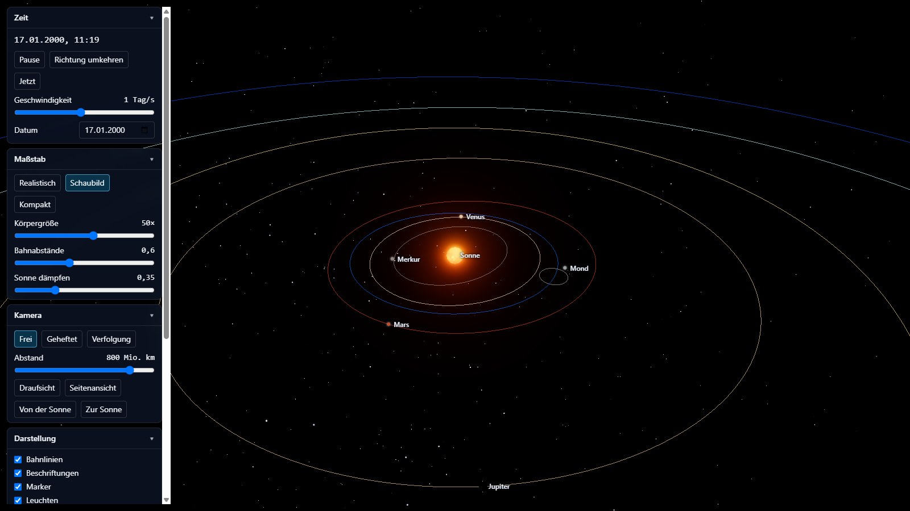
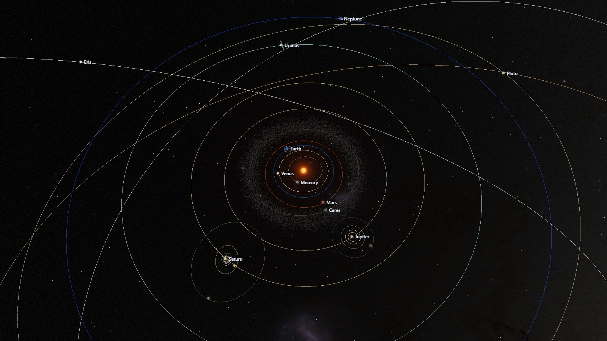
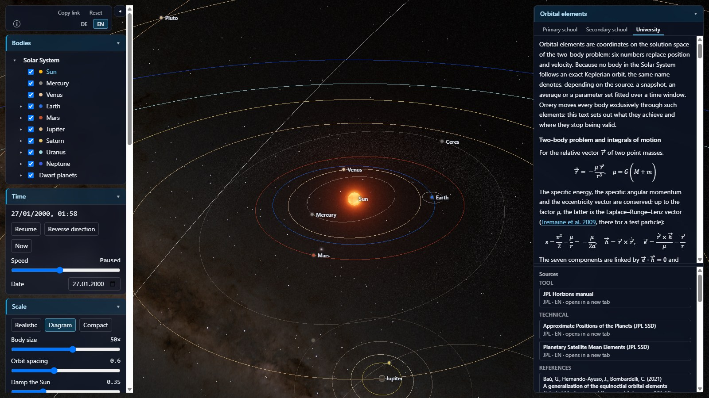
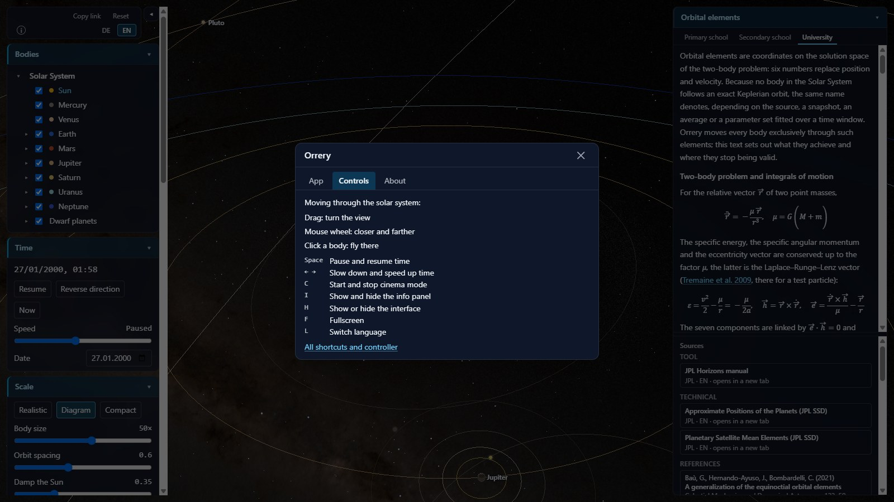
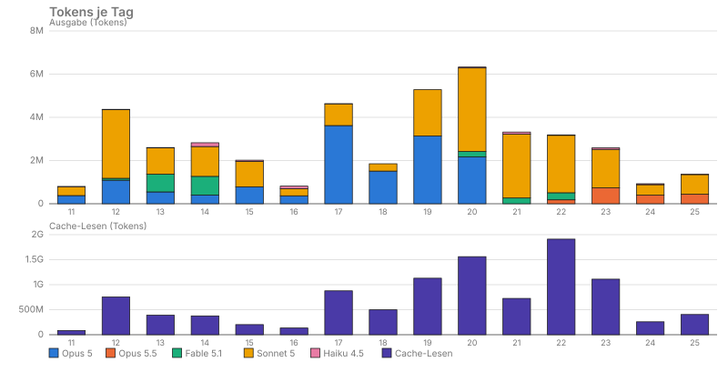

# Wie Orrery entstand

[English](entstehung.en.md) | **Deutsch**

Orrery ist eine interaktive 3D-Simulation des Sonnensystems im Browser, entstanden zwischen dem
11. und dem 25.09.2026 — 15 Kalendertage, 673 Commits, vom Ursprungsprompt bis zur Seite unter
<https://orrery3d.de>. Diese Seite erzählt zwei Geschichten zugleich: die von Orrery als
Werkzeug der Wissenschaftskommunikation, mit belegten Quellen auf drei Niveaustufen, und die
eines Wegs, mit dem KI-Coding-Assistenten Claude Code (Anthropic) — einem nicht deterministisch
arbeitenden Sprachmodell — eine deterministische, überprüfbare Anwendung zu bauen. Einzelheiten,
Commit-Kürzel und Belege für jede Zahl auf dieser Seite liefert die [Chronik](chronik.de.md).

## 1. Die Idee

Der [Ursprungsprompt](ursprungsprompt.md) an Claude Code verlangte ausdrücklich, zuerst mit dem
Brainstorming-Skill zu interviewen, dann ein Design-Dokument vorzulegen, und erst danach zu
planen und in kleinen, testbaren Schritten umzusetzen. Dieser Ablauf — Brainstorming, Entwurf,
Freigabe, Plan, Umsetzung, Abnahme — zieht sich durch das ganze Projekt; die verwendeten Skills
stammen aus der Sammlung Superpowers, einem Plugin von Jesse Vincent. Aus dem ersten Interview
mit Jens Fricke am 11.09.2026 stand fest: Orrery soll Lernwerkzeug und Showpiece gleichrangig
sein, das Bahnmodell rechnet analytisch nach Kepler und ist gegen Referenzwerte testbar, und das
Repository bleibt bis zur Fertigstellung privat. Zwischen dem ersten und dem letzten Commit
dieser Etappe (`32072ef`, `b9e4283`) vergingen keine drei Minuten — noch kein Code, noch keine
Tests. [Chronik](chronik.de.md#idee)

## 2. Zeitleiste

Meilenstein und Commit-Zahl je Tag; „Tag“ nennt die an diesem Tag gesetzte Versionsmarke.

| Datum | Meilenstein | Tag | Commits |
|---|---|---|---:|
| 11.09.2026 | Ursprungsprompt, Design-Dokument, Beginn Phase 1 | — | 18 |
| 12.09.2026 | Phase 1 abgeschlossen, Phase 2, Beginn Phase 3a | v0.1.0/v0.2.0 | 67 |
| 13.09.2026 | Phase 3a/3b, Umbenennung in Orrery, Phase 4a | v0.3.0 | 62 |
| 14.09.2026 | Phase 4b, Deploy-Skript, Beginn Phase 4c | — | 62 |
| 15.09.2026 | Grundschul-/Gymnasialtexte, Klickflächen | — | 35 |
| 16.09.2026 | Szenentexte Phase 4c | — | 18 |
| 17.09.2026 | Abschluss Phase 4c, Beginn Phase 4d | v0.4.0 | 50 |
| 18.09.2026 | Phase 4d, Fachthemen | — | 12 |
| 19.09.2026 | Zeitbereich, Flug, Repository öffentlich | — | 77 |
| 20.09.2026 | Phase 4d, innere Planeten | — | 46 |
| 21.09.2026 | Phase 4d, Jupitersystem | — | 29 |
| 22.09.2026 | Phase 4d, Saturn- und Uranussystem | — | 59 |
| 23.09.2026 | Abschluss Phase 4d, Nachführung, Beginn Phase 5 | v0.5.0 | 64 |
| 24.09.2026 | Phase 5, Mobile, Texturen, Musik | — | 33 |
| 25.09.2026 | Abschluss Phase 5, Milchstraße, Info-Karte, Kleinigkeiten, Domain | v0.6.0–v0.7.2 | 46 |

## 3. Phasen

Von der ersten lauffähigen Szene bis zur heutigen Simulation liegen 15 Tage:

### Phasen 1–3: Durchstich, Katalog, Gürtel und Schatten

Zuerst ein lauffähiger, vertikaler Durchstich durch die ganze Kette von Eingabe bis Darstellung
(v0.1.0, 152 Tests, rund 11,1 Stunden), dann — laut Interview-Entscheidung vorgezogen — ein
Kino-Modus mit Vollbild und automatischer Kamerafahrt (v0.2.0, rund 0,9 Stunden). Es folgte der
Ausbau des Katalogs auf 20 Monde und 5 Zwergplaneten, dazu Planetenringe (Phase 3a, 689 Tests,
Hauptchunk 1 096,84 kB, rund 22,1 Stunden), dann ein Asteroidengürtel als `THREE.Points` mit Bahnrechnung im
Vertex-Shader — 50 000 Keplerlösungen je Bild wären in JavaScript zu teuer gewesen — und echte
Schatten über analytische Okkluder statt Shadow-Maps, wegen der großen Maßstabsspanne und eines
exakten Halbschattens aus Kreisüberlappung (Phase 3b, v0.3.0, rund 8,7 Stunden). 46 Minuten nach
dem Tag wurde das Projekt in „Orrery“ umbenannt.
[Chronik: Phase 1](chronik.de.md#phase-1) · [Phase 2](chronik.de.md#phase-2) ·
[Phase 3a](chronik.de.md#phase-3a) · [Phase 3b](chronik.de.md#phase-3b)

### Phasen 4a–4d: Englisch, Persistenz, Infopanel, Hochschultexte

Die Oberfläche wurde zur Laufzeit auf Englisch umschaltbar, ohne externes i18n-Framework, mit
`en-GB` als englischer Locale (Phase 4a, 848 Tests). Es folgten Zustände über Sitzungen hinweg —
geteilte Links, gemerkte Sitzung, ein Panel „Ansichten“ (Phase 4b) — und ein Infopanel mit
kuratierten Quellenkarten und drei Textstufen je Körper und Thema; der Quellenkatalog wuchs dabei
von 24 auf 66 Einträge (Phase 4c, v0.4.0, 2892 Tests). Nebenher entstanden anklickbare Körper,
Namen und Bahnen im Bild (Klickflächen, 2003 Tests); ein in Phase 4d gefundener Absturz —
Saturns Bahnexzentrizität wurde bei linear fortgeschriebener Rechnung ab dem Jahr 12 563
rechnerisch negativ — führte zu einem festen Zeitbereich vom 1. Januar 1 bis 31. Dezember 9999;
dazu kam freies Fliegen mit Tastatur, Maus und Xbox-Controller.

Den Abschluss bildete die dritte, unbegrenzte Textstufe „Hochschule“ mit Formeln, Tabellen und
Primärliteratur, in elf Etappen gefüllt: 761 maschinell gegen Crossref oder arXiv geprüfte
Literaturzitate, 138 Hochschuldateien (69 Deutsch, 69 Englisch) mit zusammen 318 938 Wörtern,
91 Quellenkarten, 5150 Tests am Ende (v0.5.0, rund 152,9 Stunden). Eine anschließende
Nachführung behob liegen gebliebene Befunde aus der Gesamtabnahme, ohne Code zu ändern.
[Chronik: Phase 4a](chronik.de.md#phase-4a) · [Phase 4b](chronik.de.md#phase-4b) ·
[Phase 4c](chronik.de.md#phase-4c) · [Klickflächen](chronik.de.md#klickflaechen) ·
[Zeitbereich](chronik.de.md#zeitbereich) · [Flug](chronik.de.md#flug) ·
[Phase 4d](chronik.de.md#phase-4d) · [Nachführung](chronik.de.md#nachfuehrung-4d)

### Phase 5: Oberfläche, Mobile, Texturen, Musik

Eine einklappbare linke Spalte, ein Kompaktmodus fürs Handy, Texturen in mehreren Stufen
(KTX2) — die 1k-Summe sank dabei auf 3 567 420 Bytes, die Ladezeit im simulierten „Fast 4G“ auf
4 543,6 ms im Median — und zuletzt ein eigener Abschnitt zu Musik. Die Phase endete mit Tag
`v0.6.0`, 5285 Tests und Hauptchunk 1 529,67 kB.
[Chronik](chronik.de.md#phase-5)

### Phase 6: Milchstraße

Die Milchstraße im Hintergrund enthält einen Gaia-Datenanteil; im Entwurf zunächst mit der
Lizenz CC BY-SA angenommen, erwies sich in der
Fachprüfung als CC BY-NC 3.0 IGO (nichtkommerziell) — für das nichtkommerzielle Orrery kein
Hindernis, aber ein nachgeführter Entwurf und eine Quellenkarte mit NC-Vermerk. Drei
Texturstufen: 59 941 Bytes (1k), 1 069 543 Bytes (2k), 30 310 600 Bytes (8k). Tag `v0.7.0`,
5328 Tests, Hauptchunk 1 531,36 kB. [Chronik](chronik.de.md#phase-6)

### Info-Karte und Kleinigkeiten

Eine Info-Karte mit den Reitern Einrichtung, Bedienung und Über sowie eine eigene Karte
Steuerung ergänzten die Oberfläche (v0.7.1, vier Stationen von 5328 auf 5371 Tests, Hauptchunk
bis 1 549,24 kB); danach schlossen kleinere, offen gebliebene Punkte die Etappe ab (v0.7.2,
5402 Tests, Hauptchunk 1 550,81 kB).

[Chronik: Info-Karte](chronik.de.md#infokarte) · [Kleinigkeiten](chronik.de.md#kleinigkeiten)

## 4. Arbeitsweise: Mensch und KI

Jens Fricke gab Richtung, Freigaben und Handprüfungen vor; Claude Code entwarf, plante und
steuerte die Umsetzung; eigenständige Subagenten übernahmen Umsetzung und Prüfung, nach
Möglichkeit mit dem kleinsten Modell, das die Aufgabe noch zuverlässig löste. Jede Phase
durchlief denselben Ablauf: Brainstorming, ein freigegebenes Design-Dokument, ein Plan, die
Umsetzung in kleinen, einzeln vergebenen Arbeitsschritten (Tasks), eine Abnahme mit
Rulings. Entscheidungen, die während eines laufenden Plans nötig wurden, traf die
steuernde Sitzung selbst als „Ruling“ statt als Rückfrage — jede mit ihrer Begründung
schriftlich festgehalten und am Ende gesammelt Jens vorgelegt.

Zwei weitere Regeln zogen sich durch alle Phasen: Sichtprüfungen liefen als Pixelmessung statt
als Eindruck — Screenshots derselben Ladung, ein Kontrollbild ohne abweichende Pixel, eine
angehaltene Uhr für reproduzierbare Aufnahmen. Und jede Literaturangabe der Hochschultexte lief
maschinell gegen Crossref oder arXiv, bevor eine Fachprüfung sie inhaltlich gegen die zitierte
Arbeit selbst prüfte — ein Kommentar im Code zählte dabei nie als Beleg. Die verwendeten Skills
stammen aus der Sammlung Superpowers, einem Plugin von Jesse Vincent, insbesondere für
Brainstorming, Entwurf, Plan und die subagentengesteuerte Umsetzung selbst.

## 5. Deterministisch mit einem nicht deterministischen Werkzeug

Die durchgesehenen Protokolle verzeichnen 37 Fälle, in denen ein Sprachmodell — als Umsetzer
oder als Prüfer — etwas falsch lieferte und eine deterministische Prüfung das fing: Fachprüfungen
fingen 25 davon, Build oder Typprüfung 2, eine Pixelmessung 1, die maschinelle Literaturprüfung
1, eine grepbasierte Durchsicht 2, Jens' eigene Handprüfung 1, eine Gesamtabnahme 4 und ein
späterer Task 1. Sieben immer wiederkehrende Maschen dieses Netzes, mit je einem echten Fall:

**Physik gegen Referenzwerte.** Die Simulation rechnet analytisch nach Kepler und wird gegen
JPL-Horizons-Fixtures getestet; nur die Darstellung darf Größen und Helligkeiten überhöhen, nie
die Physik selbst. Diese Trennung hat Grenzen: Bei linear über Jahrtausende fortgeschriebener
Bahnrechnung wurde Saturns Exzentrizität rechnerisch ab dem Jahr 12 563 negativ, der Keplerlöser
brach mit einem Fehler ab, und die Bildschleife blieb stehen. Eine Fachprüfung während der
Arbeit an den Hochschultexten fand den Fall; die Antwort war kein Sonderfall im Code, sondern ein
fester, dokumentierter Zeitbereich vom 1. Januar 1 bis zum 31. Dezember 9999.

**Tests als Vertrag.** Die Testzahl wuchs von 152 beim ersten Durchstich auf 5402 am Ende; vor
jedem „fertig“ liefen `lint`, `tsc -b --noEmit` und `build` dazu. Dass ein grüner `npm
test`-Lauf keine Typen prüft, zeigte sich mehrfach: Ein literaler Import aus `node:fs` in einer
Testdatei ließ den Build erst nach dem Testlauf abbrechen, noch am selben Tag behoben.
Ehrlich bleibt dabei: Keiner der 37 oben genannten Fälle wurde von einem automatisierten
Test allein gefangen, immer erst zusammen mit Build, Messung oder einer Fachprüfung.

**Messen statt Anschauen.** Sichtprüfungen liefern Pixelwerte, keine Eindrücke: Screenshots
derselben Ladung, Differenzbilder mit einem Kontrollbild ohne abweichende Pixel, eine
angehaltene Uhr für reproduzierbare Aufnahmen. Das fing zum Beispiel einen Klick, der in der
dichten Systemansicht Mars traf, aber Deimos auswählte — eine Sub-Pixel-Koinzidenz, bei der die
bloße Rangfolge nach Bildtiefe statt nach Nähe zum Zeiger entschied. Erst eine Pixelmessung legte
das offen; die Korrektur gab jeder Scheibe ein eigenes Feld für ihre Art und eine zweistufige
Rangfolge.

**Belege statt Behauptungen.** 761 Fachpublikationen bilden den Literaturkatalog der
Hochschultexte, jede maschinell gegen Crossref oder arXiv geprüft — und jede Aussage zusätzlich
gegen die zitierte Arbeit selbst, nicht gegen einen Kommentar im Code. Ein Thema zu den
Bahnelementen schrieb die Herkunft aller Mondraten pauschal einer einzigen Quelle zu; tatsächlich
stammte eine der Raten aus der siderischen Umlaufzeit, nicht aus jener Quelle. Eine Fachprüfung
fand die Verwechslung, eine zweite, gesondert dokumentierte Prüfrunde stellte sie richtig. Typische
Fehler dieser Art waren Größenordnungen, falsch zugeschriebene Werte und verwechselte
Quellenjahre — nie erfundene Zitate.

**Menschliche Tore.** Brainstorming, Entwurf, Freigabe, Plan, Umsetzung, Abnahme — jede Etappe
brauchte Jens Frickes Zustimmung, bevor die nächste begann, und Rulings statt Rückfragen hielten
laufende Pläne in Bewegung. Daneben blieb die reine Handprüfung am echten Gerät ein eigenes Tor:
Das Symbol ⓘ für Info und Hilfe erwies sich am Desktop-Bildschirm als zu klein — kein
automatischer Test hätte das gefunden, nur Jens' eigener Blick auf den Bildschirm. Der Knopf
wanderte danach in die Sprachzeile der Kopfzeile.

**Begrenzte Freiheit.** Kleine Tasks je Sitzung, ein Umsetzer gleichzeitig (Subagenten teilen
sich einen Browser), höchstens eine Prüfrunde je Text und möglichst kleine Sprachmodelle — vier
Regeln, die Freiheit und Kosten zugleich begrenzen. Ihre Grenze zeigte sich, als eine mechanische
Bereinigung verbotener Formulierungen in Beleglisten zunächst dem kleinsten eingesetzten Modell
übertragen wurde: Der erste Durchlauf ließ 37 eigentlich erfasste Treffer stehen, ein zweiter Versuch
strich stattdessen unbeteiligte Stellen und löschte Hinweisnummern ersatzlos.
Eine grepbasierte Durchsicht fing beide Male, bevor eine Fachprüfung überhaupt nötig wurde; die
Wiederholung lief danach auf dem mittleren Modell. Seither starten ähnliche, regelgebundene
Bereinigungen gleich dort.

**Determinismus in der App selbst.** Nicht nur der Arbeitsablauf, auch die Anwendung selbst ist
deterministisch angelegt: reine Funktionen in der Simulationsschicht, ein Zeitbereich mit festen
Grenzen statt unbegrenzter Fortschreibung, Schichten mit einseitiger Abhängigkeit und eigenen
Schichtentests. Ein Beispiel: Das Datumsfeld schnitt sein Zeitformat zunächst auf zehn Zeichen
zu; bei einem negativen Jahr fehlte darin der Tag, der Browser verwarf den Wert, und das Feld
blieb leer. Eine Fachprüfung fand das, die Korrektur war eine einzige reine Funktion, die Jahr,
Monat und Tag unabhängig vom Vorzeichen zusammensetzt — keine Sonderfallkette im UI-Code.

**Was das Netz nicht fing.** Ehrlich bleibt auch, was das Netz nicht oder erst spät fing. Ein
Typfehler aus einer Nacharbeit ließ den Produktivbau erst nach einem bereits grünen Testlauf
abbrechen — eine der Lehren daraus: `npm test` prüft keine Typen, `tsc -b --noEmit` gehört in
jede Abschlussprüfung. Und selbst eine Gesamtabnahme kann irren: Sie führte drei
Gymnasialbefunde noch als offen, obwohl sie längst behoben waren, und vermerkte in einem
anderen Fall an einer Stelle des eigenen Protokolls „berichtigt“, an einer zweiten Stelle
desselben Protokolls für dieselbe Zuschreibung weiterhin „offen“. Diesen zweiten Widerspruch
deckte erst die Prüfung eines späteren Teils dieser Chronik auf, direkt am Commit `63d3144`
nachvollzogen. Das Netz aus Prüfungen fängt vieles zuverlässig, aber nicht immer
beim ersten Blick — manchmal erst eine zweite, unabhängige Prüfung.

## 6. Was es gekostet hat

Ausgewertet wurden die lokalen Sitzungsprotokolle des Assistenten zu diesem Projekt: 52
Hauptsitzungen und 756 Subagentenläufe bis zum Stichtag, dem Upload des Domain-Fixes am
25.09.2026 (`f3807c7`). Veröffentlicht werden nur Summen, nie Protokollinhalte. Jede Antwort
zählt einmal, erkannt an ihrer Nachrichtenkennung; beim Streaming steht dieselbe Antwort mehrfach
im Protokoll, gezählt wird deshalb je Feld der Höchstwert über alle Zeilen — ohne diese Regel
ergab eine Probe für Claude Sonnet 5 nur 1,9 statt 23,8 Mio. Ausgabetokens.

Bis zum Stichtag kamen so 44 895 Antworten mit rund 42,9 Mio. Ausgabetokens, rund 10,4 Mrd.
Tokens Cache-Lesen, rund 0,2 Mrd. Tokens Cache-Schreiben und rund 153 000 ungecachten
Eingabetokens zusammen — insgesamt rund 10,7 Mrd. Tokens, davon rund 98 % Cache-Lesen. Rund
82,7 % aller vier Kategorien zusammen entfielen auf Subagentenläufe, der Rest auf die
Hauptsitzung mit dem steuernden Modell. Rund 65 % aller Antworten kamen von Claude Sonnet 5,
rund 23 % von Claude Opus 5; die übrigen liefen auf Claude Opus 5.5, Claude Fable 5.1 und, für
rein mechanische Arbeiten, dem bewusst kleinsten Modell, Claude Haiku 4.5. Am Anfang, vor dem
ersten Subagentenlauf, lief nahezu alles auf dem größten Modell; mit wachsendem Projekt übernahm
zunehmend das mittlere Modell den Löwenanteil.

Dass das Lesen des immer weiter wachsenden Kontexts die Summe bestimmt und nicht das Schreiben
von Code, ist kein Zufall: Kleine Tasks je Sitzung und möglichst kleine Modelle sind direkte
Antworten auf genau diese Kostenstruktur — jede neue Antwort liest Pläne, frühere
Entscheidungen und bereits geschriebenen Code erneut, bevor sie etwas Neues beiträgt.

Die Protokolle liegen nur lokal vor und sind nicht gegen eine Abrechnung abgeglichen; Zählweise
und Stichtag stehen hier, damit sich die Zahlen einordnen lassen. Die vollständige
Aufschlüsselung nach Tag, Phase und Modell steht im
[Anhang der Chronik](chronik.de.md#anhang-tokens).

## 7. Lehren

- **`npm test` prüft keine Typen.** Ein literaler Import und, später, ein Typfehler aus einer
  Nacharbeit ließen `tsc -b --noEmit` beziehungsweise den Produktivbau erst nach einem bereits
  grünen Testlauf abbrechen. Seither gehört ein eigener Typ- und Baulauf in jede
  Abschlussprüfung, nicht nur `npm test`.
- **Auch eine Prüfung kann irren.** Eine erste Rechnung zu einer Szene kam wegen eines eigenen
  Vorzeichenfehlers auf einen falschen Wert; eine Gesamtabnahme hielt drei bereits behobene
  Befunde für offen und widersprach sich in einem Punkt sogar selbst. Beide Fälle löste erst
  eine zweite, unabhängige Prüfung auf.
- **Kommentare im Code sind kein Beleg.** Mehrere Zuschreibungsfehler in den Hochschultexten
  gingen auf einen falschen oder ungeprüften Kommentar zurück, nicht auf die zitierte Arbeit
  selbst; die Regel, jede Aussage an der Quelle zu prüfen, blieb deshalb ausnahmslos.
- **Regelgebundene Bereinigungen brauchen das richtige Modell.** Zwei Versuche einer
  mechanischen Textbereinigung auf dem kleinsten eingesetzten Modell scheiterten an Regeltreue,
  bevor eine Wiederholung auf dem mittleren Modell gelang. Ähnliche Bereinigungen starten
  seither gleich dort.
- **Sichtprüfungen brauchen Pixelwerte, keine Eindrücke.** Ein Klick, der in der dichten
  Systemansicht das falsche Ziel traf, fiel erst bei einer Pixelmessung auf, nicht beim
  Hinsehen.
- **Ein Umsetzer gleichzeitig.** Subagenten teilen sich denselben Browser; parallele Umsetzung
  hätte Sichtprüfungen und Messungen gegenseitig verfälscht — deshalb lief zu jedem Zeitpunkt
  höchstens eine Umsetzung.

## 8. Weg zur Domain

Das Repository blieb von Anfang an privat, ohne Deployment vor der Fertigstellung — eine der
ersten Entscheidungen des Projekts, drei Minuten nach dem Design-Dokument. Am 14.09.2026 entstand
das Deploy-Skript für die Veröffentlichung per FTPS samt Umgebungsvorlage; am 19.09.2026 wurde
das Repository öffentlich, mit offener Lizenz. Am 24.09.2026 kam eine installierbare Web-App mit
Vollbildstart und eigenem Symbol dazu, dazu ein Hochladen Datei für Datei mit Wiederholung bei
Netzfehlern.

Zwei Commits am 25.09.2026 lösten schließlich die letzten Hindernisse für die eigene Domain: Die
feste Basis für alle Pfade erzeugte unter `https://orrery3d.de` 500-Antworten des Servers, weil
die Domain direkt auf den Projektordner zeigt; relative Pfade laufen seither unter beiden
Adressen. Ein globaler Server-Alias lieferte außerdem eigene Symbole statt der App-Symbole aus;
die Symbole zogen deshalb in einen eigenen Ordner um. Seither läuft die Seite unter
<https://orrery3d.de> ebenso wie unter <https://www.jensfricke.com/Orrery/>, hochgeladen per
FTPS. [Chronik](chronik.de.md#domain)

## 9. Kennzahlen

- **673 Commits** in 15 Kalendertagen (11.–25.09.2026).
- **5402 Tests** in 127 Testdateien, Hauptchunk 1 557,08 kB (gzip 430,04 kB) — Stand nach dem
  Domain-Fix.
- **761 Fachpublikationen** im Literaturkatalog der Hochschultexte, jede maschinell gegen
  Crossref oder arXiv geprüft, verbunden mit 91 kuratierten Quellenkarten.
- **138 Hochschuldateien** (69 Deutsch, 69 Englisch) mit zusammen 318 938 Wörtern (151 719
  Deutsch, 167 219 Englisch).
- **Zeitbereich** vom 1. Januar des Jahres 1 bis zum 31. Dezember 9999.
- **Texturen** in mehreren Stufen (KTX2); die Milchstraßenkarte allein in drei Stufen von
  59 941 Bytes (1k) über 1 069 543 Bytes (2k) bis 30 310 600 Bytes (8k).
